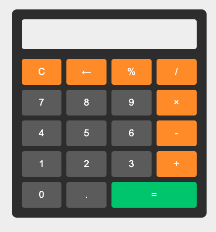

# Simple JavaScript Calculator

A clean and functional calculator built with HTML, CSS, and JavaScript. This calculator performs basic arithmetic operations and includes additional features like percentage calculations and backspace functionality.

## Features

- Basic arithmetic operations (addition, subtraction, multiplication, division)
- Percentage calculations
- Clear function (C)
- Backspace function (←)
- Decimal point support
- Error handling
- Responsive design

## Technologies Used

- HTML5
- CSS3 (Grid Layout)
- JavaScript

## Live Preview

You can try the calculator here: [Live Demo](https://dilan1994.github.io/Calculator-JS/)

## Screenshot



## How to Use

1. Clone the repository:
   ```bash
   git clone https://github.com/dilan1994/Calculator-JS.git
   ```

2. Open `index.html` in your web browser

3. Start calculating!

## Features Explained

- **Number Buttons (0-9)**: Click to input numbers
- **Operators (+, -, ×, ÷)**: Click to perform basic arithmetic
- **Decimal Point (.)**: For decimal numbers
- **Clear (C)**: Clears the display
- **Backspace (←)**: Removes the last entered character
- **Percentage (%)**: Converts numbers to percentages
- **Equals (=)**: Calculates the result

## Development

To modify this calculator:

1. Fork this repository
2. Make your changes
3. Test thoroughly
4. Submit a pull request

## Future Improvements

- Scientific calculator functions
- Keyboard support
- History of calculations
- Theme switcher (dark/light mode)

## License

This project is open source and available under the [MIT License](LICENSE).

## Contact

- GitHub: [@dilan1994](https://github.com/dilan1994)

## Acknowledgments

- Inspired by modern calculator designs
- Built as part of learning JavaScript and DOM manipulation